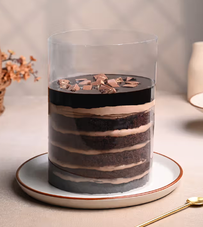
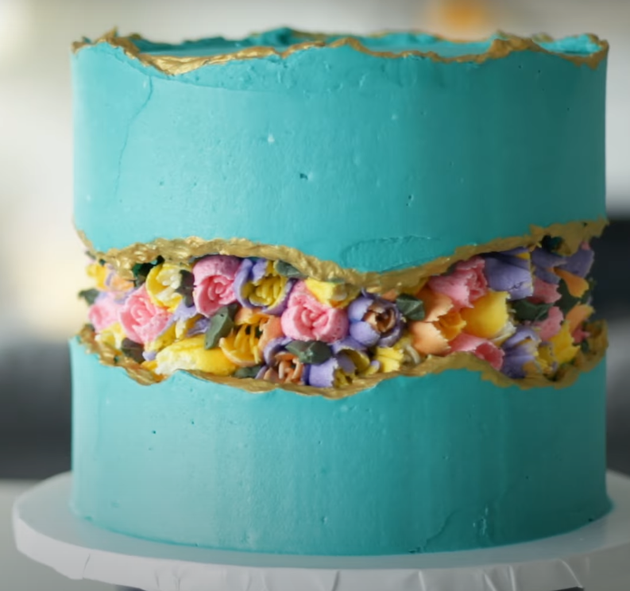

# Curso de decoración de pasteles

## Diccionario gastronómico

- Repasador: Paño de trabajo de microfibra utilizado en cocina.
- Cocción en blanco: técnica utilizada en la preparación de tartaletas donde solo se cocina la base sin el relleno.
- Bowl: Recipiente.
- Batidor de aire o globo: Se utiliza para incorporar aire a las mezclas, como en el caso de los merengues.
- Batidor de lira: Se utiliza para unificar ingredientes como el caso de los buttercream galletas o ganache.
- Batidor de gancho: se utiliza en panadería o para amasar.
- Cornet: Espátula pequeña.
- Boquilla de estrella: Son aquellas que tienen >=3 y <=7 puntas.
- Boquilla Rizadas: Son aquellas que tienen >= 8 puntas.

## Los Merengues (Semana 1)
Existen tres tipos de merengues, los cuales son _el francés_, _el suizo_ y _el italiano_. Para todos la proporción es 1:2 siendo 1 parte de claras por 2 partes de azúcar.

### El Merengue Francés
Es un tipo de merengue "crudo", es decir, no lleva cocción durante la preparación. Esto al ser así hace que su consumo humano no sea recomendable posterior a las 8hrs.

>**Advertencia:** No se recomienda consumir este merengue al haber trascurrido las 8hrs tras su preparación. Esto es así por posibilidad de desarrollarse la bacteria llamada Salmonella.

#### Preparación
- Separar las claras de las yemas del huevo.
- Una vez separadas las claras y limpias de cualquier parte de cascaras o yemas pesarlas.
- Con el resultado anterior lo multiplicamos x2 y así obtendremos la cantidad necesaria de azúcar a requerir.
- Mezclar ambos ingredientes hasta obtener la consistencia de merengue.
- Se recomienda el uso de un estabilizador en la mezcla para que la mezcla quede con más resistencia, tales como CMS, Crémor tártaro o sal. se recomienda una pizca de cualquiera.

>**Protips:** Esta preparación queda mejor si primero se baten las claras hasta que levanten y después que estén montadas se incorpora la azúcar en forma de lluvia lentamente a la mezcla.

>**Protips 2:** Si se cuenta con termómetro, al alcanzar los 60°C se deja batiendo a esa temperatura alrededor de 4-5 minutos para pasteurizar un poco las claras de huevo siempre removiendo constantemente para evitar su cocción.

### El Merengue Suizo
Es un tipo de merengue que lleva cocción en su preparación muy similar a un _baño de maría_.

#### Preparación
- Separar las claras de las yemas del huevo.
- Una vez separadas las claras y limpias de cualquier parte de cascaras o yemas pesarlas.
- Con el resultado anterior lo multiplicamos x2 y así obtendremos la cantidad necesaria de azúcar a requerir.
- En una olla, colocar ambos ingredientes y llevarlos a fuego lento (o uno encima de otro donde el de abajo contiene como un baño de maría) e ir removiendo hasta que la azúcar en la preparación sea imperceptible al tacto.
- Cuando la azúcar alcance ese punto, batir hasta obtener la consistencia de merengue.
- Se recomienda el uso de un estabilizador en la mezcla para que la mezcla quede con más resistencia, tales como CMS, Crémor tártaro o sal. se recomienda una pizca de cualquiera.

### El Merengue Italiano
Es un tipo de merengue que al igual que el Suizo también lleva cocción y su textura es un poco más firme que los anteriores.

>**Protips:** Profesor recomienda este para manguear.

>**Protips 2:** Si se cuenta con termómetro, el momento para comenzar a batir las claras es cuando el almíbar toca los 100°C, y el punto para retirar el almíbar del fuego es cuando llega entre 115°C-120°C. Una vez comience a integrarse ambos ingredientes se bate alrededor de 5 min más o hasta que esté completamente frío el bowl y bien integrado ambos ingredientes.

#### Preparación
La preparación de este merengue involucra dos etapas, luego de hacer separado las claras haber obtenido la proporción de azúcar. Se hace de la siguiente manera:

- En una olla colocar la proporción de azúcar humedecida con agua (El agua es para hacer que la mezcla quede como un almíbar ligero, por tanto no es necesario que sean partes iguales o demasiada agua).
- Cocinar el azúcar hasta que esta se disuelva y empiece a hacer burbujas espesas o alcanzar el _punto de bola suave_.
- Cuando la azúcar ya alcance _el punto de bola suave_ o este próximo a alcanzarlo se empiezan a batir las claras en la batidora hasta montar.
- Una vez alcanza este punto se va a pasar la preparación en forma de hilo y lentamente mientras batimos la mezcla de claras previamente montadas.
- Se recomienda el uso de un estabilizador en la mezcla para que la mezcla quede con más resistencia, tales como CMS, Crémor tártaro o sal. se recomienda una pizca de cualquiera.

### Consideraciones adicionales de los merengues

#### Colorantes
Los que se deben utilizar son los **hidrosolubles** o colorantes disolventes en agua.

#### Menos dulce
Se recomienda mantener la misma proporción para todos los tipos de merengues. En los casos en los que se necesite que quede _menos dulce_ lo que se recomienda es sustituir el azúcar por edulcorante o una azúcar más amigable con la persona afectada.

#### Saborizar
Los merengues se pueden saborizar recomendablemente con saborizante (El profesor no recomienda con jugos). Se podrían saborizar con Fructus, pero si se hace con esta opcion se debe de restar a la cantidad de azucar a usar la cantidad de mezcla del Fructus.

De usar el Fructus el mismo se echa luego de haber preparado el merengue como tal y de haber montado las claras a punto de letra.

>Nota: Puede darse el caso que las esencias o saborizantes ya contengan color. Si esto no afecta al resultado final no hay ningún problema, sin embargo si quiero que la mezcla tenga un determinado color y de por sí el saborizante tiene otro diferente, esto podrá afectar el color resultante. En este caso se recomienda usar saborizantes trasparentes.

#### Utilización
Se recomienda su utilización para decoración en una preparación (torta) que este fría preferiblemente de 24hrs.

#### ¿Por qué no levantan las claras?
Existen diversos factores por el cual el merengue no pudiera levantar, conocer cuáles son los factores que lo impiden es útil para minimizar esta posibilidad:

- Bowl o recipiente contaminado con materia grasa o húmedo. Los mismos deben estar limpios y secos (recomendablemente limpios con vinagre).
- La preparación de claras debe estar totalmente depurada de cascaras de huevo, yemas.
- Los huevos debes estar a temperatura ambiente.
- El sentido de batido (si se bate a mano) es aconsejable realizarlo todos en la misma mano para mantener el mismo sentido de batido.
- Sobrebatido.
- Utilización de colorantes incorrectos, como podría ser el de polvo.
- ingredientes incorrectos, como podría ser una azúcar muy gruesa. Cuando tenemos como ingrediente una azúcar muy gruesa se recomienda llevarla a licuadora para "refinarla" un poco. Y en caso de ser neva azúcar industrial de tipo Moltanban no es recomendable porque contienen almidón de maíz y secan los merengues.

#### Batido con batidora de mano
Se recomienda batir siempre en la misma dirección, bien sea moviendo el bowl de izquierda a derecha o de derecha a izquierda. Para los casos en los que se usa una batidora eléctrica manual, se recomienda mover la batidora de arriba a abajo mientras se rota el bowl hacia cualquiera de los lados como se aprecia en la siguiente imagen:

<div align="center">
    
    <small><p>Forma de batir con batidora manual.</p></small>
</div>

#### Decorar o rellenar
Los merengues se deberían de usar siempre para decorar. Para rellenar no es recomendable puesto que en su mayoría su composición es aire y por ende se caerá/absorberá por el peso de la torta. De usarse como relleno, se debe hacer un hueco dentro de la torta y verter el relleno ahí y luego tapar con la parte de arriba, esto con la idea de que no se apoye todo el peso de la torta en él o mezclarlo con frutas para que los pedazos de las mismas sirvan de apoyo.

## Tabla de costos (Semana 2)
La tabla de costos es procedimiento en cual nos permite plasmar todos los ingredientes a utilizar para así obtener el precio final que tendrá nuestro producto.

Para efectos de este ejemplo la usaremos teniendo en cuenta algunos de los ingredientes que se usan a la hora de hacer una torta, pero puede ser utilizado para cualquier tipo de preparación.

La tabla se comienza realizando de teniendo en cuenta las siguientes columnas:

| Ingredientes  | Medida de ngredientes  | Costo de ingredientes | Cant. Utilizada | Costo C/U |
|---------------|------------------------|-----------------------|-----------------|-----------|
|               |                        |                       |                 |           |
|               |                        |                       |                 |           |

Donde:
 - **Ingredientes:** Corresponde a la columna donde se colocarán todos los ingredientes individualmente que son medibles/pesables.
 - **Medida de ingredientes:** Corresponde a la columna donde se especifica en qué medida o presentación se obtuvo el ingrediente.
 - **Costo de ingredientes:** Corresponde a la columna donde se va a colocar el costo de dicho ingrediente, es decir el total pagado por el mismo.
 - **Cant. Utilizada:** Corresponde a la columna que se utiliza para especificar la cantidad que se utilizó de dicho ingrediente.
 - **Costo C/U:** Corresponde a la columna donde se especifica el costo de la cantidad utilizada de dicho ingrediente.

Entonces teniendo en cuenta todo lo anterior, podemos obtener la siguiente tabla con un ingrediente para una torta:

| Ingredientes  | Medida de Ingredientes | Costo de Ingredientes | Cant. Utilizada | Costo C/U |
|:-------------:|:----------------------:|:---------------------:|:---------------:|:---------:|
| Harina trigo  |                        |                       |                 |           |

Luego se procede a rellenar los datos del ingrediente de la siguiente manera:

| Ingredientes  | Medida de Ingredientes | Costo de Ingredientes | Cant. Utilizada | Costo C/U |
|:-------------:|:----------------------:|:---------------------:|:---------------:|:---------:|
| Harina trigo  | 1000gr                 | 3$                    | 500gr           | 1.5$      |

Donde se quiere decir:
 - Se compró una harina de trigo cuya presentación (Medida de ingrediente) es de 1000gr (1kg).
 - La harina me costó  3$ (Costo de Ingredientes).
 - De los 1000grs de harina utilicé para la preparación 500gr (Cant. Utilizada).
 - Mi costo de utilización (Costo C/U) de la harina cuya fórmula es = (Costo de Ingredientes/Medida de Ingredientes)*Cant. Utilizada. Lo cual quiere decir que mis 500grs de harina tienen un costo de 1.5$ para esta preparación.

Entonces teniendo en cuenta lo anterior podemos seguir obteniendo los datos de todos los ingredientes faltantes para mi ejemplo de preparación de torta quedando la tabla de la siguiente manera:

| Ingredientes  | Medida de Ingredientes | Costo de Ingredientes | Cant. Utilizada | Costo C/U |
|:-------------:|:----------------------:|:---------------------:|:---------------:|:---------:|
| Harina trigo  | 1000gr                 | 3$                    | 500gr           | 1.5$      |
| Huevos        | 30und                  | 6$                    | 5und            | 1$        |
| Azúcar        | 1000gr                 | 3$                    | 500gr           | 1.5$      |
| Mantequilla   | 500gr                  | 2.5$                  | 250gr           | 1.25$     |
| Leche         | 1000ml                 | 4$                    | 250ml           | 1$        |

En este punto es deducible que en la compra de todos los ingredientes de la tabla se gastó un total de 18.5$ (que representa a la suma de toda la columna de los costos de los ingredientes), sin embargo, no se utilizó la cantidad total de todos los ingredientes, por lo tanto seria injusto cobrar dicha suma, lo más justo a la hora de considerar el precio total de ingredientes es la suma de la columna de Costos C/U, la cual nos da un total de 6.25$.


| Ingredientes  | Medida de Ingredientes | Costo de Ingredientes | Cant. Utilizada | Costo C/U |
|:-------------:|:----------------------:|:---------------------:|:---------------:|:---------:|
| Harina trigo  | 1000gr                 | 3$                    | 500gr           | 1.5$      |
| Huevos        | 30und                  | 6$                    | 5und            | 1$        |
| Azúcar        | 1000gr                 | 3$                    | 500gr           | 1.5$      |
| Mantequilla   | 500gr                  | 2.5$                  | 250gr           | 1.25$     |
| Leche         | 1000ml                 | 4$                    | 250ml           | 1$        |
|               |                        |                       | **Total**       | **6.25$** |


A este precio final (6.25$) le debemos de considerar otros gastos, los cuales son:

 - **Gastos Operativos:** Deberían de variar del 10% al 35% del total de la preparación y engloba aquellos gastos de ingredientes que no son medibles, como podrían ser el chorrito de vainilla, la pizca de sal, las boquillas compradas para esa mezcla, colorante, detergentes etc. Dependiendo de la cantidad de elementos que consideremos que van en esta apartado será el porcentaje a elegir.
 - **Gastos Administrativos:** Representan los gastos que son fijos, como podrían ser los servicios de agua, luz, gas, mano de obra del personal (si es mensual y fijo), etc.
 - **Porcent. De Ganancia:** Es el porcentaje de ganancia que varía desde el 30% en adelante, en el cual hay que considerar qué voy a vender y a quién.

 Entonces teniendo en cuenta lo anterior, podemos suponer que en nuestra preparación de mezcla utilizamos una pizca de sal y un chorrito de vainilla que no fueron cuantificables. Entonces podemos asumir que es viable optar por deducir el 10% del total como parte de gastos operativos.

| Ingredientes  | Medida de Ingredientes | Costo de Ingredientes | Cant. Utilizada                      | Costo C/U |
|:-------------:|:----------------------:|:---------------------:|:------------------------------------:|:---------:|
| Harina trigo  | 1000gr                 | 3$                    | 500gr                                | 1.5$      |
| Huevos        | 30und                  | 6$                    | 5und                                 | 1$        |
| Azúcar        | 1000gr                 | 3$                    | 500gr                                | 1.5$      |
| Mantequilla   | 500gr                  | 2.5$                  | 250gr                                | 1.25$     |
| Leche         | 1000ml                 | 4$                    | 250ml                                | 1$        |
|               |                        |                       | **Total**                            | **6.25$** |
|               |                        |                       | **Gastos Operativos (10%)**          | **0.62$** |

Como parte de mis Gastos Administrativos para esta preparación podemos considerar que el uso del 10% del total resultante en la suma del total + los gastos operativos es lo justo. Quedaría entonces de la siguiente manera:

| Ingredientes  | Medida de Ingredientes | Costo de Ingredientes | Cant. Utilizada                      | Costo C/U |
|:-------------:|:----------------------:|:---------------------:|:------------------------------------:|:---------:|
| Harina trigo  | 1000gr                 | 3$                    | 500gr                                | 1.5$      |
| Huevos        | 30und                  | 6$                    | 5und                                 | 1$        |
| Azúcar        | 1000gr                 | 3$                    | 500gr                                | 1.5$      |
| Mantequilla   | 500gr                  | 2.5$                  | 250gr                                | 1.25$     |
| Leche         | 1000ml                 | 4$                    | 250ml                                | 1$        |
|               |                        |                       | **Total**                            | **6.25$** |
|               |                        |                       | **Gastos Operativos (10%)**          | **0.62$** |
|               |                        |                       | **Gastos Administrativos (10%)**     | **0.68$** |


Como parte de mi Porcentaje de ganancia consideramos que el porcentaje base (30%) se ajusta para el ejemplo. Entonces le sacamos el 30% al valor resultante entre la suma del total más los otros gastos, quedando de la siguiente manera:

| Ingredientes  | Medida de Ingredientes | Costo de Ingredientes | Cant. Utilizada                      | Costo C/U      |
|:-------------:|:----------------------:|:---------------------:|:------------------------------------:|:--------------:|
| Harina trigo  | 1000gr                 | 3$                    | 500gr                                | 1.5$           |
| Huevos        | 30und                  | 6$                    | 5und                                 | 1$             |
| Azúcar        | 1000gr                 | 3$                    | 500gr                                | 1.5$           |
| Mantequilla   | 500gr                  | 2.5$                  | 250gr                                | 1.25$          |
| Leche         | 1000ml                 | 4$                    | 250ml                                | 1$             |
|               |                        |                       | **Total**                            | **6.25$**      |
|               |                        |                       | **Gastos Operativos (10%)**          | **0.62$**      |
|               |                        |                       | **Gastos Administrativos (10%)**     | **0.68$**      |
|               |                        |                       | **Porcent. De Ganancia (30%)**       | **2.26$**      |
|               |                        |                       | **Subtotal**                         | **9.81$ ~10$** |

Colocando todos los gastos y la ganancia, podemos deducir que el precio final seria 9.81$ exactamente, pero podemos redondear (hacia arriba), para obtener un monto más estable.

>Nota: No cobrar por lo que cobra la competencia, puesto que la escala de precios que se manejan puede ser muy diferente a la nuestra.

### Consideraciones para los ingredientes y costos
No permitir que los clientes traigan los ingredientes como parte de exoneración o reducción de costos. Por que cuando esto sucede muchas veces el cliente busca imponer un criterio de economía sobre calidad, escogiendo siempre lo más económico y pudiendo así comprometer la calidad de la preparación.

Si se desea bajar el precio por alguna razón, siempre optar por recudir el porcentaje de ganancia, para que la preparación y gastos no se vean comprometidos.

Si bien el costo que me da la columna de "Cant. Utilizada" es más acertado, se debe tener en cuenta que **cuando se empieza** se tendrá cierto desequilibrio en las finanzas puesto que puede que algunos emplaces no se vendan en la cantidad exacta requerida y por ende toque comprarlo en la cantidad total. Estos materiales quedaran para futuros trabajos a posterior servirá para recuperar _la inversión inicial_.

Aunque los gastos Operativos y Administrativos junto a la Ganancia pareciera que debería ir en relación siempre al Total, el profesor comenta que van en correlación, es decir; se considera el porcentaje sobre el total anterior sumado, ejemplo: gastos operaciones = total + 10%, gastos administrativos = gastos operativos + 10% y ganancia = gastos administrativos + 10%.

```
#####################################
Como calcular mi fondo para casos de emergencia? para no tocar la ganacia
#####################################
```

## Buttercream (Semana 2)
El Buttercream o crema de mantequilla es un tipo de crema que se realiza con materia grasa y azúcar glass/impalpable. Es un tipo de crema más estable que permite tener alisados más prolijos y formas con mangas mas definidas. Sirve para decorar, como recoge migas, alisar, rellenar, para pegar el fondant y  para crear muros de contención.

La materia grasa puede ser de tipo manteca vegetal, mantequilla sin sal o margarina. Aunque de usarse con margarina, se debe tener en cuenta que esta última es una grasa más delicada y si se mezcla de forma muy agresiva puede llegar a derretirse. Para contrarrestar esto y darle más estructura, se puede mezclar con un ganaché mágico de chocolate blanco derretido para darle más firmeza a su estructura.

Cuandos se agrega chocolate derretido se usa una medida de 1/3 o el 30%

```
#####################################
Un 1/3 o 30% de que elemento?
buttercream de chocolate
#####################################
```

Se debe tener en cuenta que dependiendo de la materia grasa escogida, tendrá cierta tendencia a un sabor. Por ejemplo, si se trabaja con mantequilla, tendrá cierto sabor a lácteo/leche, si se usa manteca; será un poco más grasosa, si es con margarina será más suave.

Independientemente de la materia grasa; siempre será en proporción es 1:2 siendo 1 parte de grasa por 2 partes de azúcar. Se puede batir con una Lira o batidor de globo.

### Preparación
Una vez teniendo la materia grasa seleccionada, la cual debe estar a punta pomada y la azúcar glass cernida se procede a:

- Batir la mantequilla hasta que la misma se creme bien. Dependiendo de la materia grasa una vez cremada podría dejarse reposar un momento.
- Incorporar la azúcar previamente cernida de a poco y a velocidad baja para así no levantar tanto polvo de azúcar durante la preparación. Una vez incorporada se puede batir a una velocidad más alta.
- Una vez incorporado los dos ingredientes, se recomienda reservar durante 10min-15min en la nevera para que tome consistencia nuevamente.

>ProTips: Al usar manteca ir echando la azúcar de a poco. Viendo y probando la consistencia para que no quede tan arenosa. Por ejemplo si bien la proporción es 1:2, ir viendo cómo va quedando cuando se va a 1/3 de la azúcar total. Recordar que se puede usar menos azúcar.

> Tip: Se puede agregar un poco de leche líquida a la preparación para que la misma se vuelva más ligera.

A esta preparación se le conoce como "buttercream base" o "buttercream americano". El cual se puede saborizar con esencias, galletas, mermeladas, frutas, colorantes, etc. para cambiar su sabor.

Dependiendo de lo que se le agregue al buttercream cambia el nombre, por ejemplo si se le agrega un merengue italiano sería un buttercream italiano.

### Receta de relleno de Buttercream de galletas Oreo
Esta es la receta que se utilizó para el relleno de la torta realizada en clase la cual es una **buttercream para relleno** y está hecha con:

- 250gr de Margarina (Mantequilla Mavesa con sal).
- 500gr de Azúcar Glass (Montalban).
- Un chorrito de vainilla.
- 12 galletas Oreo.

##### Preparación
Una vez preparado el buttercream base y saborizado con vainilla se procede a:

- Incorporar la crema de las galletas oreos y tener cuidado con sobrebatir porque es muy delicada la margarina. Una vez incorporada la crema de las galletas dejar reposar la crema.

- Triturar las galletas para luego incorporarlas lo más polvo posible para evitar que al cortar desprenda pastel. No es necesario cernirlas.

- llevar a refrigeración de 10min-15min para luego utilizar.

>Nota: Al tratarse de un relleno, se pueden agregar gotas de chocolates, sprinkles, lluvias de colores, galletas María, etc.

### Receta de cobertura de Buttercream de Café
Esta es la receta que se utilizó para el decorado y la capa recoge migas de la torta realizada en clase, la cual es una **buttercream para cobertura** y está hecha con:

- 250gr de Manteca Vegetal.
- 400gr de Azúcar Glass (Montalban).
- ~1/4 de taza de Café fuerte sin azúcar.
- Una pizca de sal.

##### Preparación
Una vez preparado el buttercream base y saborizado con un chorrito de vainilla se procede a:

- Agregar el café fuerte el cual debe estar totalmente frio.

Si se utiliza Café instantáneo se debe cernir, porque es polvo y trae grumos.

Se debe tener en cuenta de no agregar demasiado Café. Aunque es a gusto mientras más líquido se agrega a la mezcla más suave será el buttercream resultante.

### Buttercream con Merengues
Es un hibrido entre buttercream y merengue. Se hace teniendo en cuenta que la cantidad materia grasa a usar (mantequilla, manteca o margarina) debe ser igual al peso los ingredientes del merengue.

Es decir, si se hace un Merengue Suizo, con 100gr de claras y 200gr de azúcar, se usará 300gr de materia grasa.

Su preparación se base en realizar el tipo de merengue preferido, y luego de haber terminado de realizarlo y estando **frio o casi a temperatura ambiente** se incorpora la mantequilla troceada poco a poco.

>**Nota del autor:** El profesor aunque mencionó esta preparación en clase no ha hecho esta receta aún ni tampoco sus ingredientes. Este escrito fue sacado de recetas de internet.

### Consideraciones adicionales del Buttercream

#### Colorantes
Los que se deben utilizar son los **liposolubles** (Al igual que el Chantilly y Chocolate).

#### Menos dulce
Se puede utilizar menos cantidad de la indicada en la proporción (1:2) pero no se recomienda agregar más.

#### Saborizar
Se puede saborizar una vez terminado de preparar el butercream base y teniendo en cuenta para que se va a utilizar dado que cuando se agrega algún aditivo que tenga _cuerpo_ como galletas, frutas  o mermeladas se utiliza para rellenar. Dado que no se pueden alisar totalmente.

Si se quiere utilizar Cacao, se debe sustituir un 20% del azúcar por Cacao.
>OJO: No se recomienda utilizar manteca animal para realizar el buttercream base porque aportan sabor.

#### Utilización
Se recomienda su utilización para decoración y rellenar.

#### Margarina
Si bien se puede utilizar como materia grasa para la preparación hay que darle un tiempo de reposo porque tiende a disolverse o derretirse más rápido que la manteca.

## Primeros pasos para alisar decoraciones (Semana 2)
Algunos pasos que se deben de tener en consideración a la hora de alisar nuestras torta son:

 - Si los rellenos son muy líquidos como podría ser una mermelada, se debe realizar un muro de contención con algún relleno para que el mismo no se salga y manche la superficie.

 - Una vez rellena la torta es una buena práctica _envolverla_ ya rellena completamente en una lamina de acetado y llevarla a refrigeración para que el relleno compacte y no se vaya a inclinar hacia algún lado.

 <div align="center">
    
    <small><p>Manera de refrigerar una torta rellena..</p></small>
</div>

 - Si la torta tiene barriga/joroba, se debe de cortar para emparejar la superficie.

 - Si la torta tiene imperfecciones como podrían ser pedazos que se despegaron a la hora de desmoldarla, se hace una mezcla con un poco de miga de la torta y crema y se tapan (frisa) los pedazos faltantes de la torta.

 - Una vez cubiertos todos los pedazos faltantes se puede proceder a hacer una cubierta recoge migas, que es una cubierta fina que se encarga de _sellar_ y dejar la superficie lista para la capa definitiva de la cubierta la cual debería de tener de ~1cm-2cm de grosor.

- Una manera de hacer la cubierta resultante podría ser abrazando la torta y con la espátula o scraper a 45° de la superficie de la torta, con una mano en la parte delantera superior y la otra mano en la bailarina, hacemos una vuelta entera de la siguiente manera:

<div align="center">
    
    <small><p>Forma de alisar la torta.</p></small>
</div>

>Nota: Hay que tener en cuenta que después de pasar con las paletas o scrapers, hay que limpiar el material raspado para que la superficie no se vea afectada.

<!--Semana Santa -->

## Arequipe (Semana 3)
Es una crema que puede usarse para rellenos o para una cobertura.

Se prepara teniendo en cuenta que: por cada 1lt de leche; corresponde 500gr de azúcar y 1 cucharada de bicarbonato.

Se puede subir o aumentar la cantidad pero respetando esta proporción, por ejemplo, el profesor preparó 500ml de leche, 250gr de azúcar y media cucharada de bicarbonato.

### Preparación
Se puede preparar de dos formas

#### Preparación en base a ingredientes base:
- En una olla (preferiblemente alta), se coloca a hervir a fuego medio la leche y el azúcar removiendo constantemente.
- Una vez que se haya reducido a la mitad la mezcla de leche y azúcar (concentrando sabores), se procede a integrar el bicarbonato de sodio. **Advertencia: al hacer esto ocurrirá una reacción donde se espera que la mezcla suba muy rápido. Hacerlo con cuidado.**
- Después de haber integrado el bicarbonato, revolver constantemente porque hay riesgo de quemar la mezcla fácilmente.

#### Preparación en base a leche condensada:
- En una olla lo suficientemente grande que nos permita cubrir totalmente nuestra lata de leche condensada acostada, se deja cocinar durante aproximadamente 2hrs. **Advertencia: De hacerse en olla de presión tener cuidado al momento de abrir. Existe riesgo de explosión.**

### Consideraciones
- Durante la preparación a base de ingredientes es importante tener en cuenta que siempre se debe estar removiendo la mezcla porque es fácil que pueda quemarse y tomar una nota ahumada que no le favorece.
- Durante la preparación a base de ingredientes es recomendable usar un nivel de fuego medio.

## Salsa de Caramelo (Semana 3)
Es un tipo de caramelo líquido cuya consistencia es similar a la salsa de caramelos de McDonalds. Sirve para usarse como  Drips o para hacer decoraciones en forma de hilos.

Se prepara teniendo en cuenta que: por cada 500gr de azúcar corresponde; 200gr de crema de leche (crema para batir repostera) y 2 cucharadas de mantequilla (puede ser margarina con sal).

### Preparación
- Derretir el azúcar en una olla sin utilizar agua y removiéndolo constantemente para evitar que se queme.
- Una vez creado el caramelo (disuelta la azúcar), se agrega la proporción de crema de leche y remover hasta incorporar completamente.
- Ya estando la crema de leche incorporada, agregar a la mezcla la mantequilla.

Si se usa margarina o mantequilla sin sal, se recomienda agregar una pizca de sal.

### Consideraciones

#### Tipo de Azúcar
Se recomienda usar alguna azúcar de buena calidad para que la misma se disuelva bien y no se cristalice en la preparación y la dañe. Recomendada: Montalban.

#### Tips para encontrar el punto
Para saber si esta lista, una vez agregados todos los ingredientes y obtenido la consistencia adecuada, se pasa la parte de abajo de una cucharilla por la salsa, luego pasar el dedo por la cucharilla para crear dos separaciones. Si ambas quedan rectas y no se unen, quiere decir que esta lista.
(TIP válido para cualquier tipo de salsa). Su consistencia es liquida a menos que se le dé mucha cocción.

#### Saborizar
De querer el caramelo salado, se le puede agregar sal (recomendada la sal gruesa o en escama para que de textura y sabor). De usar margarina con sal no es necesario usar sal.

Se puede saborizar con un poco de vainilla

## Ganaché de Chocolate (Semana 3)
Es una crema a base de crema de leche y chocolate. Se puede usar tanto para rellenos como para decorar y si se usa con chocolate blanco también puede ser usado como Drip.

Su proporción para la preparación es 1:1. Es decir, partes iguales de chocolate y crema de leche.

### Preparación
- Trocear el chocolate en partes pequeñas y reservar.
- Llevar a fuego la crema de leche hasta que la misma rompa hervor.
- Una vez la crema de leche rompa a hervor, se procede a incorporar al chocolate reservado fuera del fogón.
- Dejar el calor de la crema de leche disuelva el chocolate totalmente sin remover durante 10seg aproximadamente.
- Transcurrido el tiempo, remover para derretir cualquier parte sobrante del chocolate.
- Una vez disuelto el chocolate, dejar de batir y tapar con papel film al contacto para que no haga costra o piel y llevar a la nevera para que endurezca.

Una vez listo si se necesita para manguear, se saca de la nevera y se lleva a una batidora (con lira preferiblemente) para obtener una consistencia para manguear.

### Consideraciones

#### Tipo de chocolate
Se puede utilizar chocolate blanco, chocolate con leche, o chocolate puro. Pero que sea cobertura o con alto contenido de grasa. Puede ser en formato de barra, gotas, monedas. No chispas de chocolate.

#### Colorante
De necesitar pintar, se recomienda usar el chocolate blanco junto a colorantes liposolubles.

## Ganaché mágico (Semana 3)
Es una mezcla de ganaché, buttercream y gelatina sin sabor la cual es mucho más resistente a las altas temperaturas y hasta la manipulación directa, permitiendo que la decoración formada perdure mucho más en el tiempo. Se puede tocar y no se daña.

La proporción de la gelatina es por 1000gr de producto, 10gr de gelatina disuelto en 5 veces su volumen en agua. O el 1% teniendo en cuenta su peso en gramos.

```
#####################################
La proporción de ganaché y buttercream es:
#####################################
```

### Preparación
- Agregar la gelatina en agua y se deja hidratar hasta que se ponga dura.
- Teniendo la gelatina dura; llevar a microondas o baño María para disolverla totalmente.
- Una vez disuelta la mezcla de gelatina y estando totalmente liquida incorporar al batido.

## Mermeladas de frutas (Semana 4)
Esta es una receta que se puede utilizar para realizar cualquier sabor de mermelada de fruta. Solo se debe sustituir la fruta a elegir. Por nombrar algunas, se pueden considerar fresas, duraznos, guanábana, melocotón, mango, pulpa de naranja, kiwi, uva, mora, piña (Esta debe estar previamente cocida), guayaba (sancochada y licuada con un poquito del jugo de la cocción) etc.
> Nota: De preferir usar la naranja completa con conchas y picada en cuartos (fruta) se debe cocinar de 3-4 veces. Es decir, llevar la fruta solo con agua a cocinar, cuando rompa a hervor, espero 15min, se saca la naranja, se bota el agua, y se repite el proceso de 3-4 veces para evitar así cualquier tono amargo. Luego de eso, cocinar normalmente con el azúcar.

Su proporción 1:1/2. Es decir es por cada 1000gr de fruta, corresponden 500gr de azúcar.

### Preparación
- De usar fruta; se procede a lavarla y limpiarlas de conchas o semillas. Luego se pican en trozos muy pequeños.
- Mezclar en un bowl la fruta (o pulpa de fruta) con el azúcar y el chorrito de limón (colado) o vinagre para que la azúcar no cristalice. Se deja reposar durante 10min aproximadamente o hasta que la fruta sude.
- Una vez transcurrido el tiempo llevar a cocción a fuego medio-bajo hasta que reduzca.
- Ya habiendo reducido, se puede definir la técnica con la cual se espesará.

#### Técnicas de espesado
Cuando reduzca a la mitad la preparación de la mermelada, se procede a espesarlo de alguna de estas dos formas:

- Reducción: Cuando se continua sola cocinándose y reduciéndose sin agregarle más nada.
- Intervención: Cuando se agrega fécula de maíz disuelta en agua. La proporción depende de la cantidad, pero para 1kg de fruta serian como 2 cucharadas de fécula de maíz. No se debe agregar demasiada.

**Nota:** El profesor realizó la mermelada y el Coulis con la misma mezcla en paralelo. Es decir, al momento de definir la técnica de espesado, separó y coló una parte de mermelada la cual colocó en otro sartén ya caliente para que no se creen grumos con agua y fécula de maíz y espeso dicha mezcla por intervención. De esta forma obtuvo dos espesores; la mermelada en sí y el Coulis.

**Nota del autor:** Realicé el Coulis de la siguiente forma:

- Use la misma proporción que la mermelada, es decir, 1 unidad de fruta y 1/2 unidad de azúcar.
- Trituré la fruta con un mezclador, la colé y reservé.
- En una olla, hice un almíbar ligero similar al caramelo que se necesita en un merengue italiano. Donde usé la misma cantidad en peso de agua según el azúcar, es decir, si tengo 50gr de azúcar, usaré 50gr de agua para mi caramelo. Luego de que el caramelo tome una consistencia espesa (sin dejar que se torne oscuro) lo bajé y reservé.
- Una vez que el caramelo enfrió, lo mezclo junto con la fruta triturada y colada.

### Consideraciones
- Siempre que rellene una torta con mermelada, se debe hacer un muro de contención y aplicarlo lo más al centro posible, dejando al menos un dedo de distancia del borde de la torta.

#### Temperatura de la fruta
La fruta debe estar a temperatura ambiente, dado que si se usa congelada la misma tendrá demasiada agua acumulada y afectará al sabor final.

#### Uso del Coulis
Al llevar ese almíbar ligero colado a cocción y espesarlo, se obtiene un Coulis, que es un mermelada ligera sin grumos. Este almíbar se puede usar para pintar las bases de las tortas o darle humedad a los bizcochos.

<!--Semana 5 - Practica: Primera alisando buttercream -->

## Fondant (Semana 6)
Es una especie de "manto" comestible de consistencia similar al foami que se utiliza para cubrir las tortas y darles un acabado muy liso. Puede ser saborizado con cualquier esencia y también puede ser teñido con colorantes.

En la clase se preparo teniendo en cuenta los siguientes ingredientes:

- 10gr de gelatina sin sabor.
- 1kg de Azúcar glass.
- 20gr de manteca vegetal.
- 60gr de agua.
- 15gr de glicerina comestible.
- 60gr de glucosa.
- 1cda de esencia al gusto.
- Fécula de maíz (Maicena).

### Preparación

#### Preparando los ingredientes
- Comenzamos hidratando los 10gr de gelatina sin sabor en los 60gr de agua. Moviéndola para disolver los grumos y reservamos hasta que vuelva una pasta.
- Cernimos los 750gr de azúcar glass y reservamos.
- Unimos los 15gr de glicerina comestible, 60gr de glucosa y los 20gr de manteca vegetal a la gelatina y llevamos al microondas hasta que derrita todos los ingredientes, calentando en intervalos (para no quemar nada) hasta que todos los ingredientes se disuelvan.
>Tip: Cuando se necesite sacar la glucosa del recipiente, es útil hacerlo con una cucharada sumergida en aceite pera que la glucosa no se quede adherida a ella.

#### Incorporando los ingredientes
- Una vez se haya derretido la glicerina, la glucosa y la manteca, se incorpora a la azúcar reservada y se bate a velocidad baja con el accesorio del gancho. De no tenerlo, se procede a amasar en un bowl a mano hasta incorporar todos los ingredientes. Podría amasarse como si fuera un pan.

#### Amasado
- Ya incorporado los ingredientes y habiendo obtenido una masa, se retira del bowl y se procede a amasar en una superficie a mano. Hay que tener en cuenta que al momento de retirarla del bowl es posible que la preparación este muy húmeda, entonces se debe enharinar la superficie con una mezcla de maicena y azúcar glass a partes iguales para no dañar la preparación y mantenga el equilibrio entre elasticidad y firmeza (este proceso se debe repetir siempre que se considere necesario durante el amasado).
- Cuando se vaya a utilizar el rodillo para darle el espesor necesario también es necesario agregarle la mezcla de maicena y azúcar para que no se pegue a la superficie del mismo.

### Consideraciones
- La gelatina generalmente se diluye en x5 veces su volumen en agua, pero para esta preparación se agregan 10gr adicionales.
- A pesar de que se utilizó en esta preparación 750gr de azúcar, esta mezcla requiere de azúcar para aportarle humedad y mantener la consistencia deseada.
- Para saborizar o pintar el fondant, se puede hacer cuando se incorporan los ingredientes o cuando se está amasando.
- Al momento de utilizar el fondant como cobertura, es necesario "pegarlo" a la superficie con cualquier pegante, como puede ser arequipe, mermelada, merengues, buttercream, etc.

## Chocolate plástico / Chocolate moldeable (Semana 6)
Es una mezcla que se utiliza para realizar decoraciones de tipo esculturales (muñecos, objetos, figuras). Su preparación es 1:1/2. Siendo entonces 1 unidad de chocolate y media unidad de glucosa.

### Preparación
- Se derrite el chocolate.
- Se derrite la glucosa.
- Una vez teniendo los dos ingredientes derretidos, se mezclan hasta que se incorporen muy bien.
- Se cubre con papel film al contacto y se lleva a refrigeración.
- Amasar al momento de necesitar hasta dar forma de plastilina.

### Consideraciones
- Se puede utilizar cualquier tipo de chocolate, bitter, oscuro o con leche, sin embargo lo que se debe tener en cuenta es que deben ser chocolates de cobertura.
- Al momento de usarse se debe tener en cuenta que debe ser utilizado con la punta de los dedos para no transmitirle calor corporal a la mezcla y no sude la glucosa.

## Torta Red Velvet (Semana 7)
Este es un tipo de Bizcocho muy clásico que se acompaña comúnmente con una crema de queso crema. Se realiza teniendo los siguientes ingredientes (para un molde de 20-23cm):

- 2 ½ tazas de harina de trigo (todo uso).
- 1 ½ tazas de azúcar blanca.
- 1 cucharadita de bicarbonato de sodio.
- 1 cucharadita de sal.
- 1 cucharadita de cacao en polvo (sin azúcar).
- 1 ½ tazas de aceite vegetal.
- 1 taza de buttermilk (suero de leche).
- 2 huevos grandes.
- 2 cucharadas de colorante rojo líquido.
- 1 cucharadita de vinagre blanco.
- 2 cucharaditas de extracto de vainilla.

>Nota: El profesor comenta que de querer sustituir el aceite por mantequilla o margarina todos los ingredientes deben de aumentar en un 20%.

### Preparación
Navegando por internet se encontró el [post](https://www.facebook.com/Rolasbonitass/posts/%EF%B8%8F-tarta-red-velvet-con-cobertura-de-queso-crema-ingredientespara-el-bizcocho-2-%C2%BD/752400450795715/) de donde se sacó la receta y la explicación para la preparación por el propio autor del post. A continuación se describe la preparación por la autor del post y la preparación realizada por el profesor:

#### Preparación por el autor del Post
- Precalienta el horno a **175 °C (350 °F)**. Engrasa y enharina dos moldes redondos para tartas (de unos 20-23 cm de diámetro).
- En un bol grande, tamiza la harina, el cacao, el bicarbonato y la sal.
- En otro recipiente, mezcla el azúcar con el aceite vegetal hasta obtener una textura suave.
- Añade los huevos, uno a uno, batiendo bien después de cada adición.
- Incorpora el buttermilk, la vainilla y el colorante rojo. Mezcla bien.
- Agrega los ingredientes secos a la mezcla húmeda, poco a poco, hasta que la masa quede homogénea.
- Finalmente, añade el vinagre blanco y mezcla suavemente.
- Divide la masa entre los moldes y hornea durante 30-35 minutos, o hasta que al insertar un palillo, este salga limpio.
- Deja enfriar los bizcochos completamente antes de desmoldar y decorar.

#### Preparación por el profesor
- Se pesan los ingredientes secos y se reservan para su posterior mezclado.
- Se integran en un bowl la harina, el bicarbonato de sodio, el polvo de hornear y la cucharada de Cacao. Todos cernidos.
- En otro Bowl se procede a batir los huevos completos hasta alcanzar el punto de letra.
- Una vez alcanzado el punto de letra se procede a incorporar el azúcar en forma lluvia.
- Se agrega poco a poco el aceite. Puede parecer que se corta la mezcla pero se debe seguir batiendo. OJO: tener cuidado al momento de incorporarlo porque si toca las aspas salpicará.
- Agregar la vainilla.
- Se procede a incorporar los secos con los líquidos (buttermilk o leche cortada) de forma alternada, comenzando con la mezcla de los secos, luego buttermilk y así hasta posteriormente acabar con los secos.
- Se agrega el colorante rojo a la mezcla.
- Llevar al horno a 180°C.

>Tips del profesor: Para que no le pegue el calor directo se puede colocar el molde donde está la preparación dentro de una bandeja para que no le pegue el calor directamente.

### Consideraciones
- Si no se consigue el buttermilk, se puede realizar agregándole a una taza de leche 1 cucharada de de vinagre o el zumo de un limón y se deja reposar 10 minutos hasta que la leche parezca cortada.
- Este bizcocho lleva un poco de colorante, y aunque la receta indica colorante líquido, no es recomendable usar ese puesto que durante la cocción pareciera que se evaporó. Mejor usar en gel.
- La miga de este bizcocho es muy frágil. Si se va a dar un acabado prolijo, se recomienda llevar a refrigeración el bizcocho antes de aplicar la cobertura.
- El cacao que se utiliza para esta preparación no es para darle sabor, es para oscurecer un poco el tono rojizo del colorante rojo. Por eso se usa en pequeña cantidad.


## Crema de Queso Crema (Semana 7)
Es una crema de sabor similar a la salsa de los Cinnamon Roll (Rollos de Canela) pero con un poco más de consistencia. Sirve tanto para relleno como para decorar. Es utilizada comúnmente en la torta Red Velvet.

Los ingredientes utilizados en clase fueron:

- 225gr de queso crema
- ½ taza (115gr) de mantequilla sin sal
- 4 tazas de azúcar glass (impalpable)
- 2 cucharaditas de extracto de vainilla
- Una pizca de sal

### Preparación
- En un bowl, batir el queso crema y la mantequilla hasta que la mezcla esté cremosa.
- Añade la vainilla y la pizca de sal.
- Poco a poco, incorpora el azúcar glas, batiendo hasta obtener una textura esponjosa y suave.
- Posteriormente se recomienda llevar a refrigeración antes de trabajar con la mezcla.

### Consideraciones
- Batir recomendablemente con la lira,
- Al momento de escoger el queso crema es preferible optar por los que vienen en formato de barra que son más firmes y tienen menor cantidad de agua, por encima de los comunes que vienen en recipientes estilo Gaby, que por lo general incluyen mucha agua y hacen que la preparación quede muy líquida.

## Armado de Tortas de más de 1 piso (Semana 7)
Cuando una torta involucra varios pisos, es necesario tener en cuenta ciertas cosas para su armado:

<div align="center">
    
    <small><p>Estructura de Torta armada.</p></small>
</div>

- La base o el piso 0 debe ser una torta que sea de un diámetro mayor a la de los pisos adyacentes.
- Entre cada torta, debe de haber un platón del mismo diámetro o un poco más pequeño que la torta que descansa en dicho platón, esto se hace para que al momento de cortar la torta superior, el corte del cuchillo tenga un fin y no siga la trayectoria completa hasta abajo, ayudando también para que al momento de retirar la porción sea mucho más fácil.
- El platón debe de estar "pegado" a la torta de abajo con cualquier crema o glucosa.
- Antes de colocar un piso (torta con su platón) se debe de preparar la torta de abajo, esto se hace haciendo una estructura con _pitillos de repostería_ que son más altos, gruesos y resistentes que pitillos normales, permitiendo soportar mayor peso. Los pitillos se deben de colocar estratégicamente para que sirvan de apoyo a la base que va con el piso. Ejemplo:

<div align="center">
    
    <small><p>Base hecha con pitillos.</p></small>
</div>

- Aunque en la imagen se ve que los pitillos "bordean" la base, en realidad se puede hacer de cualquier forma geométrica que permita una buena distribución y resistencia al peso. Como por ejemplo en X, Cuadrado, Triángulo, etc.
- Este proceso debe de realizarse **por cada piso de torta**, siendo entonces la estructura a formar; y si fuera posible podría usarse una columna principal que conecte todos los pisos y sus respectivas "platones" tal como se ve en esta imagen:

<div align="center">
    
    <small><p>Estructura completa del montaje.</p></small>
</div>

- Este proceso se recomienda realizarlo en el lugar del evento. Dado que es muy riesgoso llevar la torta ya armada al sitio.
- Si bien las tortas de los pisos inferiores llevan una torta en la parte de arriba, se pueden alisar como de costumbre todas por separado y después se unen ya decoradas. O si se tiene la destreza, se unen todas y se alisan ya montadas.

## Falso Coral (Semana 8)

<div align="center">
    
    <small><p>Falso Coral.</p></small>
</div>

Es una preparación de agua, aceite y harina en proporción 1:1:20%. Es decir, 1 unidad de agua, 1 unidad de aceite y el 20% de la suma de las unidades anteriores es de harina. Ejemplo: 50gr de agua, 50gr de aceite, 20gr de harina (Correspondiente al 20% de 100). Su sabor es neutro, dado que para su preparación no es necesario azúcar, sal, esencias o colorantes. Sin embargo de requerirlo se le puede aportar. Esta es una preparación que se usa más que todo para decorar un plato o torta.
>Nota: Lo que agarra el colorante en este caso es la harina, y como se usa poca cantidad de harina no hace falta mucho colorante para que tome un color muy intenso.

### Preparación
Se prepara de la siguiente manera

#### Preparando ingredientes
- Se procede a pesar la unidad de agua.
- Se procede a pesar la unidad de aceite.
- De la suma de unidades del agua y el aceite se deduce la harina.
- De requerir, usar sal, azúcar o colorantes.
- Se vierte todos los ingredientes en un tetero o salsero y se bate bien hasta obtener una mezcla homogénea.

#### Cocción
- Se calienta muy bien un sartén y luego de estar caliente se baja la temperatura a media-alta. Sabremos que está muy caliente cuando se posa la mano encima del sartén **sin tocarlo** y no toleramos 5 segundos.
- Una vez alcanzada la temperatura ideal, se vierte la mezcla en el sartén, haciendo uso del salsero y mediante el mismo se da la forma deseada.
- A medida que se va cocinando debemos ir retirando la grasa residual de la preparación inclinando el sartén.
- Se sabe cuando está listo cuando deja de burbujear y se separa del sartén.

#### Acabado
- Una vez terminada la cocción se recomienda colocar en un plato junto a una servilleta para que absorba la grasa de la preparación.
- Si se van a hacer más, en este punto, luego de haber retirado la preparación del sartén, el mismo debe de limpiarse de cualquier residuo de aceite, o mezcla para que no altere las siguientes cocciones.

### Consideraciones
- El aceite sobrante de la cocción puede ser reutilizado.
- Como lo que se _cocina_ realmente es la harina, y la misma es muy poca cantidad, esta se puede tornar dulce o salada con muy poca cantidad de azúcar o sal respectivamente.
- Para hacer esta preparación se recomienda un sartén antiadherente.
- Si se hacen trazos muy pequeños o delgados, es posible que queden demasiados frágiles y se rompan al manipularlos o intentar sacarlos del sartén.
- La cocción de la preparación es rápida.
- Si bien no se pueden mezclar varios colores para crear un marmoleado, se pueden hacer dos preparaciones por separadas y se vierten al mismo momento para crear ese efecto. Si se tiene buena temperatura al momento de freír puede emular dicho efecto.

## Falso Caviar (Semana 8)

<div align="center">
    
    <small><p>Falso Caviar.</p></small>
</div>

Es una preparación que tiene como ingredientes un gelificante de tipo Agar-Agar, aceite frio, y algún líquido o zumo de fruta para darle sabor. Se usa para decorar platos y postres.

Se debe tener en cuenta que se necesita muy poco Agar-Agar para esta preparación. Aproximadamente por cada 100Ml de zumo o líquido de la mezcla se usan 1gr de Agar-Agar.

### Preparación
- Antes que todo se debe de tener un vaso o recipiente lleno de aceite muy frío.
- Se comienza llevando a fuego el líquido o zumo de la fruta hasta que hierva.
- Una vez que rompa a hervor se incorpora el Agar-Agar y se revuelve constantemente para evitar grumos.
- Con la mezcla homogénea se procede a pasarla a un tetero o recipiente que permita dispensar pequeñas gotas.
- Teniendo la mezcla en el recipiente, se procede a dispensar las gotas de la mezcla en el aceite frio. Este choque térmico es el que permitirá solidificar el Agar-Agar, encapsulando el líquido o zumo de fruta con formas de caviar.
- Se deja reposando las gotas en el aceite frio durante un rato.
- Una vez tenida la cantidad de gotas deseadas de la mezcla, se debe proceder a _lavar_ las gotas con agua para separar el aceite de las mismas y se puedan comer.

### Consideraciones
- Se puede usar cualquier jugo o líquido de cualquier sabor. Excepto la piña por sus encimas antigelificantes.
- Antes de verte el contenido en el salsero es buena idea colarlo primero para evitar cualquier grumo.
- En esta preparación el ingrediente irremplazable es el Agar-Agar.
- El Agar-Agar es termorreversible, lo que significa que si se vuelve a calentar a 80°-90°C se volverá nuevamente líquido.
- Por la alta temperatura a la que vuelve a estar en estado líquido se puede determinar que resiste muy bien las altas temperaturas.
- Se debe tener en cuenta que el Agar-Agar no reacciona tan bien con algunas mezclas ácidas, entonces de no gelificarse, se procede a calentar para disolver nuevamente y bajar la acidez de la preparación con un poco de agua, azúcar o un poco de ambas.

## Efectos con Chocolate (Semana 8)
Se pueden hacer varios efectos o formas con chocolate, sin importar si es tipo oscuro, de leche o blanco. Lo importante es que sea chocolate cobertura. En clase se hicieron los siguientes efectos:

### Efecto Marmoleado

<div align="center">
    
    <small><p>Chocolate con efecto marmoleado.</p></small>
</div>

Se hace con chocolate cobertura blanco junto a chocolate en polvo. Se realiza de la siguiente manera:

- En una superficie de acetado o antiadherente limpia; se rocía un poco de chocolate en polvo (que es lo que simulará las betas del mármol) y se reserva.
- Se derrite el chocolate blanco.
- Una vez derretido, se vierte en la superficie donde se ha esparcido el chocolate en polvo y se procede a extender con la ayuda de una espátula. No es necesario llevar a la nevera.
- Cuando esta casi frio y aun flexible es el mejor momento para picarlo con la ayuda de algún molde de galletas o un cortador. Dado que si se endurece se puede quebrar demasiado, lo cual puede ser perjudicial si no buscamos ese efecto.

### Líneas de chocolate

<div align="center">
    
    <small><p>Chocolate con efecto rasgado.</p></small>
</div>

Es una técnica que se hizo con el chocolate blanco y de leche y con la ayuda de un scraper. Se realizó de la siguiente manera:

- En una superficie de acetado o antiadherente limpia; se vierte el chocolate blanco previamente derretido y se esparce con la ayuda de una espátula.
- Una vez creada una película de chocolate en toda la superficie, se procede a _rasgar_ la superficie con la ayuda de un scraper con bordes de sierra para crear canales donde se verá el otro tipo de chocolate.
- Se vierte el chocolate de leche y se esparce cuidadosamente con la espátula por toda la superficie.
- Cuando esta casi frio y aun flexible es el mejor momento para picarlo con la ayuda de algún molde de galletas o un cortador. Dado que si se endurece se puede quebrar demasiado, lo cual puede ser perjudicial si no buscamos ese efecto.

### Consideraciones
- En ambos efectos con el chocolate, siempre la parte _brillante_ es la que va al frente.
- Siempre se debe de limpiar el acetato o superficie para que no quede residuos que impida que se despegue o afecte el efecto deseado.
- Un buen indicador para saber cuándo es momento de despegar el chocolate o cuando esta cerca de solidificarse es notar cuando pasa de estar brillante a opaco.

## Decoración con Flores (Semana 8)
Al momento de decorar una torta con cualquier tipo de flor es necesario tener en cuenta lo siguiente:

- El tallo de la flor debe de prepararse de forma que quede corto, libre de suciedad y otras ramas. Además la punta del tallo debe de cortarse en diagonal para facilitar el incrustado en la superficie.
- Se recomienda que el tallo este envuelto en floral-tape o en cinta adhesiva para evitar el contacto directo con la torta.
- Existe diversas flores comestibles como las que se usan para hacer té.

## Crema Chantilly (Semana 9)
Es un tipo de crema que se hace a base de crema de leche y azúcar glass. Sirve para decorar y rellenar, sin embargo si es para relleno; es mejor usarlo junto a algún elemento que le ayude a mantener la estructura, como mezclarlo con frutas, galletas, o con muros de contención ya que su estructura final es similar a la de un merengue y ante mucho peso/presión se deshace.

Aunque la preparación original amerita comprar los ingredientes separados, últimamente sale más económica comprar las preparaciones que vienen ya mezcladas de 1lt. Donde únicamente se debe batir.

### Preparación
En clase utilizamos la mezcla que ya viene lista de batir, la cual ya tiene incorporado la azúcar glass y la crema de leche y solo es cuestión de batir hasta llegar a punto de Chantilly y ya estaría listo.
>Nota: Una vez alcanzado el punto de Chantilly, dejar de batir, dado que si seguimos batiendo se puede cortar la mezcla dañándola y dando como resultado una separación de grasa y liquido.

### Consideraciones

#### Frio previo
Esta es un tipo de crema donde se recomienda que **TODO** este frio. El bowl donde se batirá, las aspas o varillas de la batidora, la crema en sí (OJO: FRIA no congelada), dado que el Chantilly interactúa muy bien con el frio.

#### Resistencia
Si se quiere dar un poco más de resistencia a las preparaciones de Chantilly, se puede lograr agregándole otros ingredientes a la preparación como podrían ser: leche en polvo, chocolate cobertura o gelatina sin sabor.

En el caso de agregar chocolate, hay que derretirlo primero hasta que no tenga grumos, luego se bate la crema y a mitad del proceso de batido, es decir, sin llegar a alcanzar el punto de Chantilly, es en ese momento cuando se incorpora el chocolate derretido que debe estar a temperatura ambiente. La proporción para que siga considerándose Chantilly puede ser para 1lt mezcla, 100gr-200gr de chocolate blanco.

Hay que tener en cuenta que mientras más chocolate se le agrega más resistente será al calor la crema, y más cerca estará de ser un Ganaché de chocolate.

En caso de agregar leche en polvo, se agregará tres cucharas de leche en polvo cernida a la preparación cuando se encuentre a medio punto, es decir, sin llegar a alcanzar el punto de Chantilly.

Es posible agregar ambos ingredientes juntos, es decir, las tres cucharadas de leche, junto con los 100gr-200gr de chocolate blanco. Para darle al Chantilly mayor firmeza.

#### Dulzor
En la clase se preparó una mezcla de Chantilly de la marca [KEN Presto](https://encrypted-tbn0.gstatic.com/images?q=tbn:ANd9GcRUbjZatByUw7MGI4EBzt7mij112vVy7VM3dQ&s) la cual resultó ser a gusto del autor bastante baja de azúcar. Ideal para personas que no son muy fan de cremas muy dulces o no puedan comer estas últimas.

#### Porosidad
Es muy probable que luego de terminar de montar la crema, la misma quede con burbujas de aire dentro de la misma, evitando que la crema tenga una textura sedosa y lisa. Para corregir esto se debe de batir en forma aplastante con un miserable. No se recomienda volver a batir con la maquina y la lira para evitar sobrebatir y que se corte la crema.

#### Saborizar
Se puede saborizar con cualquier esencia.

#### Color
Se puede pinta la crema recomendablemente con colorantes en gel.

## Decoración Fault Line Floral (Semana 9)

<div align="center">
    
    <small><p>Tipos de Fault Line.</p></small>
</div>

En decoración de pasteles la técnica de Fault Line consiste en mostrar una especie de "grieta" o simular el aspecto de una superficie agrietada.

Concretamente, en la clase se hizo estilo Floral, es decir, donde estaba la grieta se agregaron Flores. Sin embargo esta tendencia decorativa se puede realizar de distintos motivos.

### Montaje
Consta primeramente de una torta de tres pisos, donde dos de ellos (los extremos), corresponden a un mismo diámetro, y otro (la parte central) es de un diámetro menor. Esto se ilustra mejor en la siguiente imagen:

<div align="center">
    
    <small><p>Posiciones de las tortas.</p></small>
</div>

Como se puede notar en la imagen, son tres tortas apiladas, donde el diámetro de la torta del centro es menor (20cm) en comparación a la de las tortas de los extremos (24cm).

También se debe de tener en cuenta el proceso de estructura descrito anteriormente en clases pasadas, lo cual nos indica que quedaría fijada de la siguiente forma:

<div align="center">
    
    <small><p>Estructura inicial.</p></small>
</div>

Una vez armada la estructura se procedió a realizar la capa  atrapa-migas (aunque también puede realizarse desarmada). Recordando que la capa atrapa-migas es una capa fina de crema que después de realizarse se recomienda refrigerar.

<div align="center">
    
    <small><p>Capa Atrapa-migas.</p></small>
</div>

Una vez cubierta la torta con su capa de atrapa-migas es momento de realizar las flores en la parte central. Cubriendo toda esta superficie con ellas.

<div align="center">
    
    <small><p>Nivel central de la decoración.</p></small>
</div>

Ya estando cubierta la parte central, ahora si se agrega una capa gruesa de crema en los extremos (arriba y abajo) y se procede a alisar.

Durante el alisado, parte de la crema se irá hacia el centro, esto creará la ilusión de superficie irregular y profundidad.

<div align="center">
    
    <small><p>Extremos.</p></small>
</div>

Ya estando cubierta se procede a alisar hasta estar satisfecho con el alisado.

Se puede agregar detalles sutiles como un borde dorado en las terminaciones irregulares del medio con ayuda de un pincel y matizadores. Recordando que se puede diluir el matizador en Vodka sin sabor.

<div align="center">
    
    <small><p>Detalles dorados.</p></small>
</div>

Opcionalmente se puede concluir agregándole salpicaduras de matizador pero hay que tener cuidado que las mismas no caigan en la parte central y manche las flores, para mantener su estética.

<div align="center">
    
    <small><p>Resultado final.</p></small>
</div>

### Consideraciones
Durante la clase no se realizó la decoración tal cual como se muestra en el texto anterior. Esta es una síntesis de un [video](https://www.youtube.com/watch?v=jGSrB5nPHNI) y la clase al cual el autor le pareció más prolija su mezcla.

Sin embargo la realización en clase fue casi igual con la excepción de que en lugar de realizar las flores luego de haber hecho la capa atrapa-migas, se hicieron las flores luego de haber alisado completamente los extremos. Quedando así casi lisa y libre de irregularidades en la parte central tal como se puede apreciar:

<div align="center">
    
    <small><p>Decoración de la clase.</p></small>
</div>

<!--Semana 9 - Practica: Realización de degradado en Chantilly -->
<!--Semana 10 - Practica: Realización de figuras de chocolate en torta con merengue italiano -->
<!--Semana 11 - Practica: Realización de Rose cake en fondant -->

## Ganaché  (Semana 12)
> [!WARNING]
> Aunque ya se vio una clase de Ganaché de chocolate y se habló acerca del Ganaché mágico, fue en esta clase donde **para el autor** se esclarecieron todas las dudas y **pudo entenderlo de mejor manera.**

El Ganaché es una crema muy sedosa a base de crema de leche y chocolate cobertura, el cual puede ser de leche, blanco, amargo o semi-amargo.

### Proporciones
Al momento de prepararlo hay que tener en cuenta que si bien la receta requiere solo de dos ingredientes, es en base al clima o a la firmeza que necesitemos la proporción que debemos seleccionar. Las cuáles son las siguientes:

- **2:1 Ganaché suave:** Cuya interpretación son 2 partes de crema de leche junto a 1 parte de Chocolate. Se suele usar para rellenos de galletas.

- **1:1 Ganaché medio:** Cuya interpretación son 1 parte de crema de leche junto a 1 parte de Chocolate. (Este fue el tipo de Ganaché que se realizó anteriormente en clase. Su consistencia fue bastante suave, muy similar a una salsa. No se vi cuando espesó).

- **1:2 Ganaché duro:** Cuya interpretación son 1 parte de crema de leche junto a 2 partes de Chocolate.
    >El asistente del profesor comentó que llegó a utilizar una proporción de 1:2.5 para exteriores en un clima de aproximadamente 12C°.

- **1:3+ Ganaché Mágico:** Se empieza a considerar que un Ganaché es mágico a partir desde la proporción 1:3 hasta la proporción 1:5. Donde por cada parte de crema de leche usaríamos el triple o el quíntuple de la cantidad de crema respectivamente el caso. Se dice que es mágico porque es un tipo de crema que al solidificarse permite su manipulación directa con las manos sin estropear la decoración o superficie.

### Preparación
- Seleccionar la proporción a usar.
- Trocear el chocolate en partes pequeñas y reservar.
- Se procede a derretir los ingredientes a fuego bajo o en microondas en pequeños intervalos. Se debe tener en cuenta qué tipo de materia grasa se tiene en mayor cantidad; dado que podría llevarse al fuego el chocolate hasta derretir para después incorporar a la crema, la crema de leche para posteriormente derretir el chocolate con ella o todo junto. Si se escoge llevar a fuego la crema de leche, es solo hasta que comience a romper hervor.
- Se procede a remover con ayuda de un miserable o un batidor de globo manual para disolver cualquier grumo y dejarla lo más homogénea posible.
- Una vez obtenido una mezcla totalmente líquida y libre de cualquier grumo se deja reposar un poco para que la misma se vuelva un poco más espesa y se pueda usar para el mangueado o el relleno.

### Consideraciones

#### Resistencia probada
En clase preparamos la proporción 1:2.5 y al solidificarse, en el salón de clase quedó muy firme. Lo suficiente para tocarlo suavemente y no deformarse pero maleable como para picarlo con un cuchillo sin ningún problema. Se guardó un pedazo en el bolso y durante el trayecto (a pie) llegó totalmente intacto y definido, conservando su forma y por su puesto su maleabilidad. Ya en la casa al estar en la nevera un rato se volvió un tanto más duro pero aun así permitía cortarlo.

#### Procedimiento e ingredientes probados
Se troceó el chocolate y se integró junto con la crema y se llevó al microondas hasta derretir el chocolate en intervalos de 30seg y revolviendo bien todo hasta crear una mezcla uniforme un poco transparente.

Se utilizó la crema para montar Ken Presto en lugar de crema de leche y chocolate cobertura blanco.

#### Colorantes
Esta preparación al no ser totalmente grasa de chocolate, permite usar colorantes en gel y no solo los liposolubles.

#### Utilización
Si la crema empieza a solidificarse antes de su utilización se puede llevar un momento a baño maría para derretir nuevamente los ingredientes, pero eso significa que debe de batirse nuevamente con el miserable o el globo manual para integrar ambos ingredientes nuevamente y homogenizar.

Si durante el alisado empieza a solidificarse se puede _derretir_ la superficie ayudándonos de una espátula metálica sumergida en agua caliente para después con el calor que absorbe dicha espátula alisarla pasándola por la superficie nuevamente.

#### Quemado
Si durante el proceso de calentado nos llegamos a pasar de cocción es importante tener en cuenta que una vez quemado se separan ambos ingredientes y no se vuelven a integrar dañando así la preparación.

#### Algunos Tips
Como esta preparación es en base a derretir chocolate, no es recomendable tener ningún ingrediente frío. Ni el chocolate ni el Chantilly, ni los bowls.

## Crema Bariloche  (Semana 12)
Es un tipo de crema que a base de un Ganaché de chocolate amargo (o semi-amargo) y arequipe (o dulce de leche) que dependiendo de su proporción puede usarse para relleno o cobertura.

### Proporciones
Si bien el profesor no dio las siguientes proporciones exactamente, él recomendó el aumento de cantidad de arequipe directamente si se quiere aumentar la consistencia resultante. Las siguientes proporciones las encontré en un [post](https://www.instagram.com/reel/C7HniCrJRb8/?hl=es) de Instagram y recomendada por una compañera de clases.

- **1:1:1.25 Bariloche suave:** Cuya interpretación son 1 partes de crema de leche junto a 1 parte de Chocolate y 1.25 partes de arequipe. Fue la que se preparó en clase y queda como una salsa de chocolate.

- **1:2:3 Bariloche sugerida:** Cuya interpretación son 1 partes de crema de leche junto a 2 partes de Chocolate y 3 partes de arequipe. Fue la que se preparó en clase y queda como una salsa de chocolate. Fue la recomendada por una compañera que la había realizado anteriormente. [post](https://www.instagram.com/reel/DLdyjyuRPeb/?igsh=MWtzbWp0bWVpNDE1ZQ%3D%3D)

- **1:1:2 Bariloche para relleno (ig):** Cuya interpretación son 1 partes de crema de leche junto a 1 parte de Chocolate y 2 partes de arequipe.

- **0.5:1:2 Bariloche para Muro de contención (ig):** Cuya interpretación son 1/2 parte de crema de leche junto a 1 parte de Chocolate y 2 partes de arequipe.

- **1:1:1 Bariloche para cobertura firme (ig):** Cuya interpretación son 1 parte de crema de leche junto a 1 parte de Chocolate y 1 parte de arequipe.

### Preparación
- Seleccionar la proporción a usar.
- Trocear el chocolate en partes pequeñas y reservar.
- Llevar a fuego la crema de leche hasta que la misma rompa hervor.
- Una vez la crema de leche rompa a hervor, se procede a incorporar al chocolate reservado fuera del fogón.
- Dejar el calor de la crema de leche disuelva el chocolate totalmente sin remover durante 10seg aproximadamente.
- Transcurrido el tiempo, remover para derretir cualquier parte sobrante del chocolate.
- Una vez disuelto el chocolate y bajada la temperatura se incorpora la proporción de arequipe y se bate hasta integrar todos lo ingredientes.

### Consideraciones

#### Resistencia probada
En clase preparamos la proporción 1:1:1.25 y se reservó un poco en la nevera durante aproximadamente 24hrs y no se volvió densa. No considero que sea tan resistente como para un relleno.

#### Ingredientes probados
Se utilizó la crema de leche Wynco y chocolate cobertura amargo.

#### Tipo de chocolate
El profesor sugirió que puede ser utilizado con cualquier tipo de chocolate cobertura, sin embargo googleando en varios sitios siempre sugieren el chocolate amargo o semi-amargo. Supongo que es por el dulzor del arequipe al integrarse a otro chocolate más dulce la hará mucho más dulce.

También se debe tener en cuenta que al mezclarlo con algún chocolate más claro el mismo puede teñirse por el color natural del arequipe.

#### Utilización
Se recomienda dejar concentrar sabores a la crema durante al menos 1 día para mejorar el sabor y la consistencia.

#### Algunos Tips
Es recomendable trabajar con arequipe de panadería que de repostería por ser más sólido o firme. Y tener en cuenta el color del mismo ya que mientras más oscuro más cocción se le dio a la preparación

<!--Semana 13 y 14 (dos clases en un mismo dia)- Practica: Realizar figuras estilo globo con chocolate y torta caricatura con fondant -->

## Figuras con chocolate tipo globo (Semana 13 y 14)
Es un tipo de decoración realizada con cualquier tipo de chocolate que sea cobertura, en una superficie un tanto suave y con la ayuda de papel envoplast. Quedando con una textura similar a la siguiente imagen:

<div align="center">
    
    <small><p>Decoración de chocolate.</p></small>
</div>

### Preparación
Para realizar esta decoración con chocolate primeramente, se debe de contar con:

#### Materiales necesarios
- Foami (de cualquier color) y de al menos tamaño carta.
- Papel envoplast suficiente para cubrir todo el foami.
- Moldes de galletas o la forma deseada.
- Chocolate de tipo cobertura.

#### Procedimiento
- Se comienza primero cubriendo completamente el foami con papel envoplast, sin dejar ningún lado sin cubrir por si escurre chocolate. Esta será nuestra superficie donde trabajaremos.
- Se corta una lámina de envoplast del mismo tamaño que el foami y se reserva.
- Se derrite el chocolate a utilizar
- Se vierte el chocolate en el foami cubierto de envoplast
- Se coloca la lamina de envoplast que se había cortado y reservado encima del chocolate, y con ayuda de esta, vamos presionando un poco para explotar o sacar cualquier burbuja de aire en la superficie, para que la misma quede lisa.
- Se saca la forma deseada con la ayuda del molde.
- Se deja reposar con ayuda de un peso en el molde para después llevarlo a la nevera.
- Una vez totalmente frio, con la ayuda del mismo molde se puede hacer presión para terminar de cortar la forma. Y se obtendría el efecto.

<div align="center">
    
    <small><p>Resultado final.</p></small>
</div>

### Consideraciones
- Al chocolate se le puede agregar colorante.
- Una vez frio se le puede añadir matizadores o escarcha comestible. Teniendo en cuenta que cuando se toca la superficie del chocolate debe ser de forma suave por si tiene alguna burbuja de aire no se hunda.
- Mientras más chocolate se use para hacer una forma más gruesa y pronunciada quedará.

## Decoración tipo caricatura (Semana 13 y 14)
Esta es un tipo de decoración hecha con fondant. En la cual se cubre el slice o torta completa tratando de simular todos los detalles de la misma torta con el fondant y bordeando cada contorno con la finalidad que parezca un dibujo/caricatura.

<div align="center">
    
    <small><p>Cartoon cake.</p></small>
</div>

### Preparación
Preparación como tal no tiene dado que es simular el decorado de una torta simple pero con fondant. Pero el tip más importante de esta decoración es definir desde el inicio el ángulo de visión de la torta, es decir, desde donde será que se verá. O en palabras simples cual será el frente. Dado que estamos simulando un dibujo y las líneas que bordean los objetos de la torta **a veces no se verán bien desde todos los ángulos**, entonces hay que definir desde el principio cual es el ángulo de visión para que todas las líneas y decoraciones concuerden y se vean armonizas. [Aquí](https://v1.pinimg.com/videos/mc/720p/c4/c7/58/c4c75896b2a3cb5a839c91d54d5437de.mp4) hay un video donde se muestra brevemente la realización.

<div align="center">
    
    <small><p>Cartoon cake realizada.</p></small>
</div>

<!-- ##########################################################
Notas desordenadas

La proporción de pastel por personas son de 80-100grs de harina por persona
Los pasapalos son 4-6 por persona en el evento
Protips: Una pizca de Pimienta negra ayuda a resaltar el sabor de las tortas de chocolate también el café
la diferencia al tacto entre la maicena y la azucar glass es que la azucar glass es sedosa mientras la maicena se siente mas seca. como que cruje al tacto.
5-10gr de sal por litro de agua en las pastas

700gr
40% aceite (280)
60% grasa (420)

Juliana
33.33% aceite (233)
66.66% grasa (466)

800


boquillas
lisas
W1m
852 ~ Wilton 2D

4B
1A
2D

técnicas
Líneas rectas lisa*
Puntos o besos* presionar parar soltar (levantamos al soltar para hacer el pico)
Puntos o besos* presionar parar soltar (soltar hacia un lado o hacia abajo para semicírculos)
Puntos o besos* presionar parar soltar (boquilla diagonal y al soltar aplastamos un poco. similar a maíz)
Espirales
Espirales superpuestas
Resortes
Corazones
Zic zac


Punto
circular 6-3-12
concha


El molde (20cmx8cm) con el papel ~15cm alto
Con papel mantequilla

la formula
7huevos
Por cada huevo pesado con cascara 55-60gr (50gr)
- 40gr de harina
- 40gr de azúcar
- 1gr de polvo de hornear
- 11gr de liquido (cualquier tipo de liquido, jugo, agua, aceite, refresco)(10gr de vainilla)

mezcla
Llevar al punto letra
Se incorporan los huevos enteros con el batidor de globo a velocidad alta
Se incorpora la azúcar en dos fases
se bate, duplica el tamaño, incorporo la primera mitad, vuelvo a batir, duplica nuevamente y vuelvo a echar el azúcar. De ahí se bate hasta llegar al punto de letra

Si con la mezcla puedo hacer una mezcla y la forma no se hunde, quiere decir que ya se llego al punto de letra. Cuando el batido se pone denso.

llegada al punto de letra y con la velocidad más baja se va agregando la harina constantemente en cucharadas.

integrada la harina, se agregan los líquidos en forma de hilo

luego bato a velocidad máxima por 3seg

dos toques para sacar las burbujas de aire.

horno
hornear a 170°C 320°F


https://www.tiktok.com/@ludcake_/video/7424309916522827014
https://www.tiktok.com/@krismariebakes/video/7201490570894789931

https://www.kowanii.com/cdn/shop/files/LeafPipingTipSet-34.jpg?v=1696148793


https://www.sugarandicecake.co.uk/images/webupload/products/wilton-234-multi-open-tip_home_9120_q5_xlarge.jpeg


https://arifeonline.com/cdn/shop/products/895-2.jpg?v=1678607587&width=720

https://arifeonline.com/cdn/shop/products/7092-2.jpg?v=1678607591

https://img.joomcdn.net/f20b7ea5886f84daec5e4e4518bec922d1e409ca_1024_1024.jpeg

https://www.cakedecoratingcentral.com.au/cdn/shop/files/loyalpipingtip1edropflowercakedecoratingcentral_600x.jpg?v=1692159597

https://i.ytimg.com/vi/lgGnxatXdKs/maxresdefault.jpg

https://www.kowanii.com/cdn/shop/files/1E7FT9FT-5.jpg?v=1696661640&width=823

https://p.globalsources.com/IMAGES/PDT/B5215481507/nozzle.jpg

https://www.bakersneedbyankush.com/product/fhl-14-nozzle

https://encrypted-tbn0.gstatic.com/images?q=tbn:ANd9GcSllo10aHJGfatwVsCGl2fmCOqWQc-EqthyDw&s

https://www.youtube.com/watch?v=PsVNYcGEZb0

https://bakingpleasures.com.au/cdn/shop/files/LTS190RP-Carded.jpg?v=1721002418&width=1445

https://thebakingtools.com/cdn/shop/files/LargeNozzle190-IcingFlowerDecoratingNozzleTip.png?v=1744813086

https://cdn.shoplightspeed.com/shops/633447/files/20406843/1500x4000x3/ateco-deep-cut-closed-star-pastry-tip-855.jpg


https://www.tiktok.com/@ambergotcakess/video/7411558383683210539

https://www.youtube.com/watch?v=QvfCxfJhjps

https://www.youtube.com/watch?v=iK2EGNRfd2o


https://www.youtube.com/watch?v=tc_lFHGUQfw
https://www.youtube.com/watch?v=8u3nRLDdf3I
https://www.youtube.com/watch?v=hZAjqsrjfnE
https://www.youtube.com/watch?v=lgGnxatXdKs
https://www.youtube.com/watch?v=PsVNYcGEZb0
https://www.youtube.com/watch?v=4jOGjpThe-Q
https://www.youtube.com/watch?v=QvfCxfJhjps
https://www.youtube.com/watch?v=iK2EGNRfd2o
https://arifeonline.com/cdn/shop/products/7092-2.jpg?v=1678607591
https://www.tiktok.com/@ambergotcakess/video/7411558383683210539

########################################################## -->